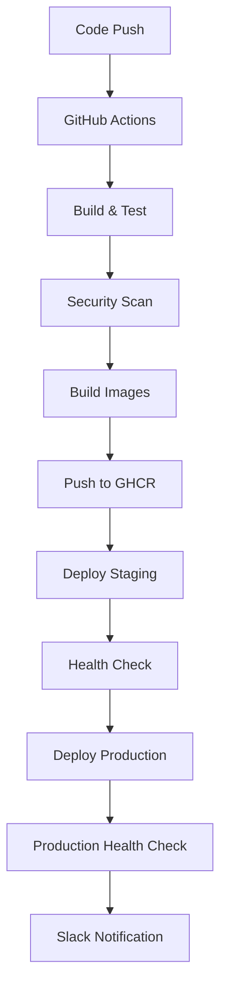

# CI/CD Setup Guide - Warehouse Management System

## Tổng quan

Hệ thống CI/CD cho Warehouse Management System được thiết kế để tự động hóa quá trình build, test, security scan, và deployment cho tất cả 9 microservices.

## Kiến trúc CI/CD

### Pipeline Stages

1. **Build and Test** - Build code và chạy unit tests
2. **Security Scanning** - Quét lỗ hổng bảo mật với Trivy và OWASP
3. **Build Images** - Build và push Docker images
4. **Deploy Staging** - Deploy lên môi trường staging
5. **Deploy Production** - Deploy lên môi trường production (sau khi staging thành công)

### Tools và Technologies

- **CI/CD Platform**: GitHub Actions
- **Container Registry**: GitHub Container Registry (GHCR)
- **Orchestration**: Kubernetes
- **Package Manager**: Helm
- **Security Scanning**: Trivy, OWASP Dependency Check
- **Code Quality**: SonarCloud
- **Monitoring**: Prometheus + Grafana
- **Notifications**: Slack

## Setup Instructions

### 1. GitHub Repository Setup

#### Required Secrets

Thêm các secrets sau vào GitHub repository:

```bash
# Kubernetes Configuration
KUBE_CONFIG_STAGING          # Base64 encoded kubeconfig for staging
KUBE_CONFIG_PRODUCTION       # Base64 encoded kubeconfig for production

# SonarCloud
SONAR_TOKEN                  # SonarCloud authentication token

# Slack Notifications
SLACK_WEBHOOK_URL           # Slack webhook URL for notifications

# Container Registry (tự động có sẵn)
GITHUB_TOKEN                # GitHub token (automatically provided)
```

#### Environment Setup

Tạo environments trong GitHub:

1. **staging** - Môi trường staging
2. **production** - Môi trường production với protection rules

### 2. Kubernetes Cluster Setup

#### Prerequisites

```bash
# Install required tools
kubectl version --client
helm version
docker version
```

#### Cluster Requirements

- Kubernetes 1.24+
- NGINX Ingress Controller
- Cert-Manager (for TLS)
- Persistent Volume support

#### Namespace Setup

```bash
# Create namespaces
kubectl create namespace warehouse-staging
kubectl create namespace warehouse-production
kubectl create namespace monitoring
```

### 3. Helm Setup

#### Install Helm Chart

```bash
# Add required repositories
helm repo add bitnami https://charts.bitnami.com/bitnami
helm repo update

# Install staging
helm install warehouse-management ./infra/helm/warehouse-management \
  --namespace warehouse-staging \
  --values ./infra/helm/warehouse-management/values-staging.yaml

# Install production
helm install warehouse-management ./infra/helm/warehouse-management \
  --namespace warehouse-production \
  --values ./infra/helm/warehouse-management/values-production.yaml
```

### 4. Monitoring Setup

#### Prometheus Installation

```bash
# Install Prometheus
helm repo add prometheus-community https://prometheus-community.github.io/helm-charts
helm install prometheus prometheus-community/kube-prometheus-stack \
  --namespace monitoring \
  --create-namespace \
  --values ./infra/monitoring/prometheus-values.yaml
```

#### Grafana Dashboards

Import dashboards từ `./infra/monitoring/dashboards/`

### 5. Security Configuration

#### SonarCloud Setup

1. Tạo project trên SonarCloud
2. Cấu hình `sonar-project.properties`
3. Thêm SONAR_TOKEN vào GitHub secrets

#### Container Security

- Trivy scanner tự động chạy trong pipeline
- OWASP Dependency Check cho .NET dependencies
- Security policies trong Kubernetes

## Deployment Process

### Automatic Deployment

Pipeline tự động trigger khi:

- Push code lên `main` branch → Deploy staging + production
- Push code lên `develop` branch → Deploy staging only
- Create Pull Request → Run tests only

### Manual Deployment

```bash
# Deploy using script
./scripts/deploy.sh staging deploy
./scripts/deploy.sh production deploy

# Check status
./scripts/deploy.sh staging status
./scripts/deploy.sh production status

# Rollback if needed
./scripts/deploy.sh production rollback
```

### Deployment Flow



## Configuration Files

### GitHub Actions Workflows

- `.github/workflows/dotnet-ci-cd.yml` - Main CI/CD pipeline
- `.github/workflows/ci-cd.yml` - Legacy Node.js pipeline (deprecated)

### Kubernetes Manifests

```
infra/k8s/
├── staging/
│   ├── namespace.yaml
│   ├── configmap.yaml
│   ├── secrets.yaml
│   ├── postgres-deployment.yaml
│   ├── api-gateway-deployment.yaml
│   ├── product-service-deployment.yaml
│   ├── payment-service-deployment.yaml
│   ├── notification-service-deployment.yaml
│   └── ingress.yaml
└── production/
    └── (similar structure)
```

### Helm Charts

```
infra/helm/warehouse-management/
├── Chart.yaml
├── values.yaml
├── values-staging.yaml
├── values-production.yaml
└── templates/
    ├── deployment.yaml
    ├── service.yaml
    ├── ingress.yaml
    └── configmap.yaml
```

## Environment Configuration

### Staging Environment

- **URL**: `https://staging.warehouse.local`
- **Database**: Separate PostgreSQL instances
- **Resources**: Lower resource limits
- **Replicas**: 1-2 per service
- **Auto-scaling**: Disabled

### Production Environment

- **URL**: `https://warehouse.local`
- **Database**: High-availability PostgreSQL
- **Resources**: Production resource limits
- **Replicas**: 2-5 per service
- **Auto-scaling**: Enabled
- **Backup**: Automated daily backups

## Monitoring và Alerting

### Metrics Collection

- **Application Metrics**: Custom metrics từ ASP.NET Core
- **Infrastructure Metrics**: Kubernetes metrics
- **Business Metrics**: Order processing, payment success rates

### Alerts

- Service down alerts
- High error rate alerts
- High response time alerts
- Resource usage alerts
- Database connection issues

### Dashboards

- **Overview Dashboard**: Tổng quan hệ thống
- **Service Dashboard**: Metrics cho từng service
- **Infrastructure Dashboard**: Kubernetes cluster metrics
- **Business Dashboard**: Business KPIs

## Troubleshooting

### Common Issues

1. **Pipeline Failures**
   ```bash
   # Check logs
   kubectl logs -f deployment/api-gateway -n warehouse-staging
   
   # Check events
   kubectl get events -n warehouse-staging --sort-by='.lastTimestamp'
   ```

2. **Database Connection Issues**
   ```bash
   # Check database pods
   kubectl get pods -l app=postgres-product -n warehouse-staging
   
   # Check database logs
   kubectl logs postgres-product-xxx -n warehouse-staging
   ```

3. **Image Pull Errors**
   ```bash
   # Check image pull secrets
   kubectl get secrets -n warehouse-staging
   
   # Verify image exists
   docker pull ghcr.io/your-org/warehouse-management/product-service:latest
   ```

### Health Checks

```bash
# Service health checks
curl -f https://staging.warehouse.local/health
curl -f https://staging.warehouse.local/api/products/health
curl -f https://staging.warehouse.local/api/payments/health
curl -f https://staging.warehouse.local/api/notifications/health

# Database connectivity
kubectl exec -it postgres-product-xxx -n warehouse-staging -- psql -U postgres -d product_db -c "SELECT 1;"
```

## Security Best Practices

### Secrets Management

- Sử dụng Kubernetes Secrets cho sensitive data
- Rotate secrets định kỳ
- Không commit secrets vào code

### Network Security

- Network policies để restrict traffic
- TLS encryption cho tất cả communications
- Service mesh (Istio) cho advanced security

### Container Security

- Scan images cho vulnerabilities
- Use non-root users trong containers
- Read-only root filesystem
- Resource limits và quotas

## Performance Optimization

### Resource Management

```yaml
resources:
  requests:
    memory: "256Mi"
    cpu: "250m"
  limits:
    memory: "512Mi"
    cpu: "500m"
```

### Auto-scaling

```yaml
autoscaling:
  enabled: true
  minReplicas: 2
  maxReplicas: 10
  targetCPUUtilizationPercentage: 80
```

### Database Optimization

- Connection pooling
- Read replicas cho read-heavy workloads
- Database indexing
- Query optimization

## Backup và Disaster Recovery

### Database Backups

```bash
# Automated daily backups
kubectl create cronjob postgres-backup \
  --image=postgres:15 \
  --schedule="0 2 * * *" \
  -- pg_dump -h postgres-service -U postgres warehouse_db > backup.sql
```

### Application Backups

- Helm chart configurations
- Kubernetes manifests
- Application configurations

### Recovery Procedures

1. **Service Recovery**: Rollback using Helm
2. **Database Recovery**: Restore from backup
3. **Full Disaster Recovery**: Rebuild cluster from IaC

## Maintenance

### Regular Tasks

- **Weekly**: Review security scan results
- **Monthly**: Update dependencies
- **Quarterly**: Review and update resource allocations
- **Annually**: Disaster recovery testing

### Updates

```bash
# Update Helm chart
helm upgrade warehouse-management ./infra/helm/warehouse-management \
  --namespace warehouse-production \
  --values ./infra/helm/warehouse-management/values-production.yaml

# Update Kubernetes manifests
kubectl apply -f ./infra/k8s/production/
```

## Support và Documentation

### Runbooks

- Service restart procedures
- Database maintenance procedures
- Security incident response
- Performance troubleshooting

### Contact Information

- **Development Team**: dev@warehouse.com
- **DevOps Team**: devops@warehouse.com
- **On-call**: +84-xxx-xxx-xxx

---

**Lưu ý**: Đây là setup guide chi tiết cho CI/CD pipeline. Đảm bảo test thoroughly trong staging environment trước khi deploy production.
